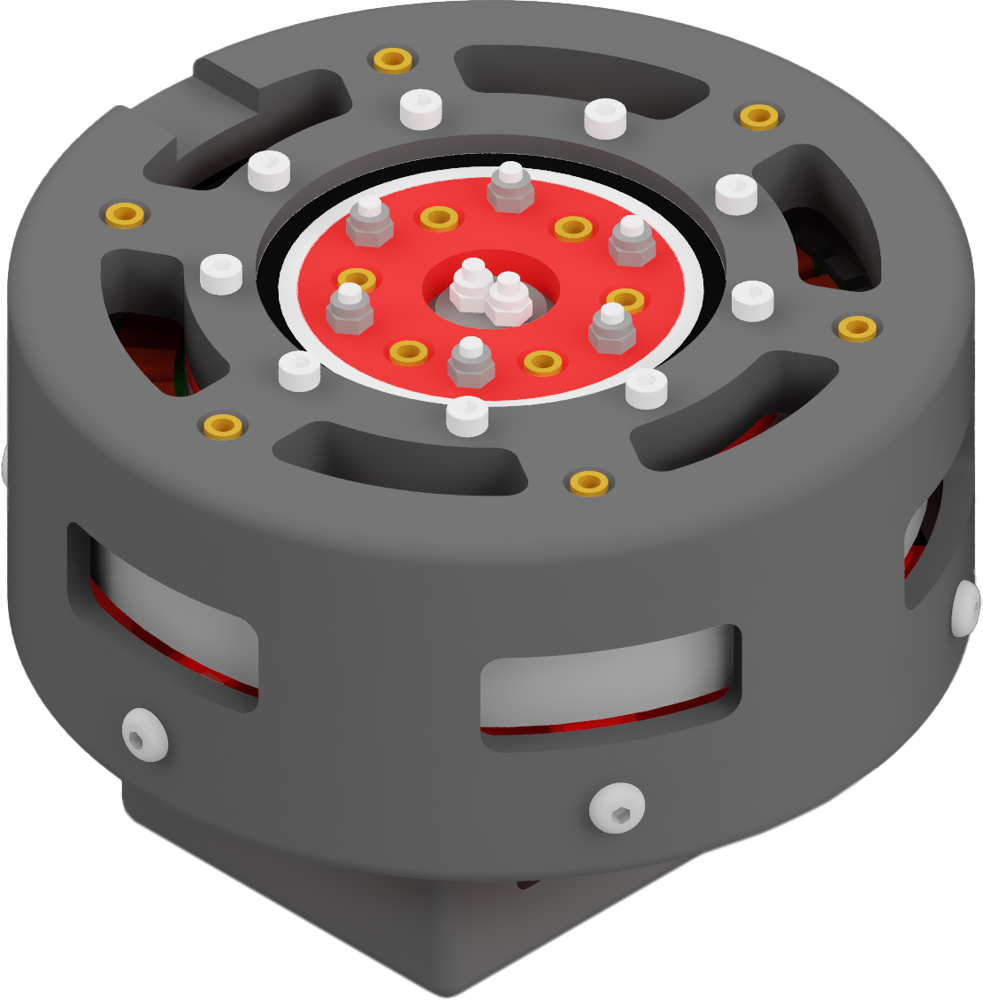
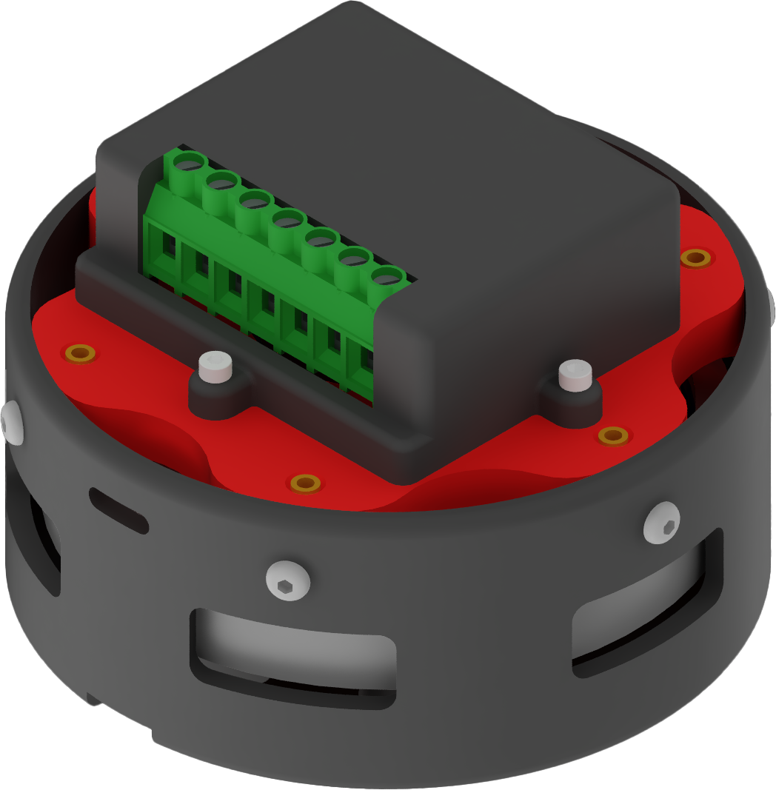

# Internal-Cycloidal-Actuator

A Quasi Direct Drive (QDD) robotics servo-motor with 8:1 cycloidal drive.

> Forked from [Internal-Cycloidal-Actuator](https://github.com/aaedmusa/Internal-Cycloidal-Actuator) by Aaed Musa.

|||
|-|-|
||

The BDLC motor is built on [10010 stator](https://www.aliexpress.us/item/3256805244129270.html) made from laminated steel sheets which increases the flux while preventing [eddy current loss](https://en.wikipedia.org/wiki/Eddy_current).

The stator has `36` slots, wound with `6` strands of `26 AWG` copper wire at `6` turns per slot (effectively `36` total turns per slot).

The rotor is machined out of 1045 Mild Steel to increase the flux of the `42`x`N52` permanent magnets attached to the rotor with JB Weld.

The actuator uses an `8:1` [cycloidal gear drive](https://en.wikipedia.org/wiki/Cycloidal_drive) mounted at the center of the motor.

The fixed ring of the gearbox (composed of roller pins) is machined out of Aluminum 6061 and fits into the center of the stator with Loctite 648 retaining compound.

The eccentric shaft of the gearbox directly mounts to the rotor of the motor. The gearbox is essentially part of the motor.

The actuator uses an [ODrive S1](https://odriverobotics.com/shop/odrive-s1) FOC Controller giving it the ability to lift loads and move to exact positions.

## Specifications

+ `36N42P` Configuration
+ `125mm` Diameter x `84mm` Height
+ `1023g` Mass
+ `209RPM` Speed at `22.2V`
+ `16.17Nm` Torque
+ `75 mOhm` Phase Resistance
+ `41.05 uH` Phase Inductance

## Bill of Materials

|Component|Qty|
|-|-|
|[ODrive S1 (w/Screw Terminals)](https://odriverobotics.com/shop/odrive-s1)|1
|[10010 Stator](https://www.aliexpress.us/item/3256805244129270.html)|1
|[26 AWG Magnet Wire](https://www.amazon.com/dp/B0978CM2NP)|1
|[10x5x3mm N52 Magnets](https://jc-magnetics.com/Magnet-N50-10mm-5mm-3mm-Block)|42
|[⌀8 x 2.5mm Encoder Magnet](https://www.andymark.com/products/redline-encoder-magnet)|1
|[3x10x4mm Bearings](https://www.amazon.com/dp/B07FW389P1?psc=1&ref=ppx_yo2ov_dt_b_product_details)|12
|[12x21x5mm Bearings](https://www.amazon.com/dp/B07FVYHWFC?psc=1&ref=ppx_yo2ov_dt_b_product_details)|4
|[40x50x6mm Bearing](https://www.amazon.com/XIKE-6708-2RS-Bearings-40x50x6mm-Pre-Lubricated/dp/B09D2RCCBG)|1
|[50x65x7mm Bearing](https://www.amazon.com/6810-2RS-Bearings-50x65x7mm-Pre-Lubricated-Bearing/dp/B09D2XDT95)|1
|[M3 x 6mm Inserts](https://www.amazon.com/gp/product/B07LBQRYR3)|22
|[M3 x 5mm Hex Standoffs](https://www.amazon.com/DTGN-M3x5mm-DXL-Standoff-Electronic/dp/B0BC8X9CPK)|18
|[M3 Locknuts](https://www.amazon.com/100Pcs-Stainless-Self-Lock-Inserted-Clinching/dp/B075ZZW7VL)|17
|[M3 x 8mm Screws](https://www.amazon.com/gp/product/B08GLLBCYV)|4
|[M3 x 10mm Screws](https://www.amazon.com/Fullerkreg-Socket-Stainless-Machine-Quantity/dp/B07CK3RSN3)|4
|[M3 x 35mm Screws](https://www.amazon.com/DTGN-M3x40mm-Stainless-Machine-Threaded/dp/B0CFV5BLRP)|9
|[M3 x 40mm Screws](https://www.amazon.com/DTGN-M3x40mm-Stainless-Machine-Threaded/dp/B0CFV44M5J)|6
|[M3 x 50mm Screws](https://www.amazon.com/uxcell-M3x50mm-0-5mm-Socket-Screws/dp/B011BNTHPS)|2
|[M4 Locknuts](https://www.amazon.com/gp/product/B08LMNFS5P)|14
|[M4 x 14mm Screws](https://www.amazon.com/M4x12mm-M4-0-7x12mm-Stainless-Machine-Quantity/dp/B0CLGWZSLT)|14
|Machined Rotor (Mild Steel 1045)|1
|Machined Fixed Ring (Aluminum 6061)|1
|Gearbox (Mild Steel 1045)|1
|Housing (Aluminum 6061)|1